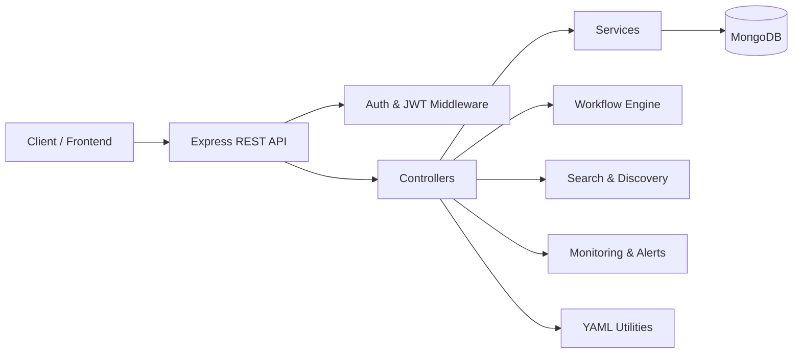

<div align="center">


</div>

---

## 📌 What Is This Project?

The **CI/CD & Infrastructure Knowledge API** is a backend REST API platform that acts as a **centralized knowledge and automation hub for DevOps teams**.

In real-world software teams, developers constantly deal with scattered information — CI/CD pipeline configs in one place, Kubernetes/Docker documentation in another, YAML files that need manual validation, and monitoring dashboards spread across different tools. This project solves that problem by bringing all of it under **one unified API**:

- It lets teams **create, run, and manage CI/CD workflows** programmatically instead of manually.
- It stores and serves a **searchable knowledge base** of infrastructure guides (Kubernetes, Docker, Helm, Terraform, AWS/Azure/GCP).
- It provides **YAML utilities** so config files can be validated, linted, formatted, and converted without leaving the platform.
- It tracks **analytics** (deployment success rate, performance, cost) so teams can make data-driven infra decisions.
- It integrates with **monitoring tools** (Prometheus, Grafana) to keep an eye on system health.
- It has its own **authentication system** (JWT + 2FA) so access is secure and user-specific.

**In short:** instead of juggling five different tools for CI/CD, docs, YAML validation, search, and monitoring, this API brings it all into one backend, exposed through clean REST endpoints that a frontend (or another service) can consume.

---

## 🧠 Why This Project Matters (Talking Points)

- **Problem it solves:** DevOps knowledge and tooling is fragmented across many platforms — this consolidates it.
- **Who it's for:** Development teams, DevOps engineers, and students learning CI/CD who need a single reference + automation point.
- **What makes it "production-oriented":** It follows real backend engineering practices — modular folder structure, middleware-based security (helmet, cors), input validation (express-validator), password hashing (bcrypt), and token-based auth (JWT) — not just a toy CRUD app.

---

## 🏗️ Architecture Overview



**How a request flows through the system:**
1. A client (frontend app, Postman, or another service) sends a request to the API.
2. The request passes through **middleware** — CORS, Helmet (security headers), and JWT authentication checks.
3. The **route** matches the request to the correct **controller**.
4. The controller calls a **service** that contains the actual business logic (e.g., "validate this YAML" or "start this workflow").
5. The service talks to **MongoDB** (via Mongoose models) to read or write data.
6. A structured JSON response is sent back to the client.

---

## 🧰 Complete Tech Stack (with Explanation)

### Backend Runtime & Framework
| Technology | Role in this Project |
|---|---|
| **Node.js** | The JavaScript runtime that executes the server-side code. Chosen for its non-blocking, event-driven architecture — good for handling many simultaneous API requests. |
| **Express.js** | The web framework built on Node.js used to define routes, handle HTTP requests/responses, and organize middleware. It's the core of the entire API layer. |

### Database
| Technology | Role in this Project |
|---|---|
| **MongoDB** | A NoSQL document database used to store workflows, users, infrastructure guides, YAML templates, analytics data, etc. Chosen because DevOps data (like workflow configs) is often semi-structured/JSON-like, which fits MongoDB's document model well. |
| **Mongoose** | An Object Data Modeling (ODM) library for MongoDB. It lets us define **schemas** (structure/rules for data) and interact with the database using clean JavaScript objects instead of raw queries. |

### Authentication & Security
| Technology | Role in this Project |
|---|---|
| **JWT (JSON Web Token)** | Used to issue secure, stateless authentication tokens when a user logs in. The token is sent with future requests to prove identity without needing server-side sessions. |
| **bcrypt** | Used to **hash passwords** before storing them in the database, so plain-text passwords are never stored. Also used to verify passwords at login. |

### Middleware & Utilities
| Technology | Role in this Project |
|---|---|
| **dotenv** | Loads environment variables (like DB connection strings, JWT secret keys) from a `.env` file, keeping sensitive config out of the codebase. |
| **cors** | Enables Cross-Origin Resource Sharing, so frontend apps hosted on a different domain/port can safely call this API. |
| **morgan** | An HTTP request logger middleware — logs incoming requests (method, URL, status, response time) to the console, useful for debugging and monitoring. |
| **helmet** | Adds security-related HTTP headers automatically (e.g., preventing clickjacking, XSS, MIME-sniffing attacks). |
| **express-validator** | Used to validate and sanitize incoming request data (e.g., making sure an email field is really an email, a required field isn't empty) before it reaches the controller logic. |

---

## ✨ Features

<table>
<tr>
<td width="50%" valign="top">

### 🔁 CI/CD Workflow Management
- Create & manage workflows
- Execute / cancel workflows
- Workflow versioning & cloning
- Logs & metrics tracking
- Trending & recommended workflows

### 🏗️ Infrastructure Knowledge Base
- Kubernetes guides
- Docker documentation
- Helm configurations
- Terraform resources
- AWS, Azure & GCP references

### 📄 YAML Utilities
- YAML validation
- Linting & formatting
- YAML ⇄ JSON conversion
- Template management
- YAML comparison & merging

### 🔎 Search & Discovery
- Full-text search
- Autocomplete & fuzzy search
- Category & tag filtering
- Trending & recommended searches

</td>
<td width="50%" valign="top">

### 📊 Analytics System
- Deployment analytics
- Success rate monitoring
- Performance metrics
- Cloud usage analytics
- Infrastructure cost analysis

### 🔐 Authentication & Security
- JWT authentication
- User profile management
- Password recovery
- Session handling
- Two-factor authentication support

### 📡 Monitoring & Alerting
- Prometheus monitoring
- Grafana integrations
- CPU, memory & storage tracking
- Uptime monitoring
- Alert management

### 🛠️ Admin Management
- User administration
- Security event tracking
- Backup management
- Cache control
- System health monitoring

</td>
</tr>
</table>

---

## 📁 Project Structure

```bash
project-root/
│
├── src/
│   ├── config/          # Environment & DB configuration
│   ├── controllers/     # Request handlers / business logic
│   ├── middleware/      # Auth, validation, error handling
│   ├── models/          # Mongoose schemas
│   ├── routes/          # Modular API route definitions
│   ├── services/        # Core service layer
│   ├── utils/           # Helper functions
│   └── app.js           # Express app setup
│
├── server.js            # Entry point
├── package.json
├── .env
└── README.md
```

**Why this structure?** It follows the **MVC-inspired separation of concerns** pattern common in production Node.js APIs:
- `routes/` → defines *what* endpoints exist
- `controllers/` → defines *what happens* when an endpoint is hit
- `services/` → contains the actual business logic (kept separate so it's reusable/testable)
- `models/` → defines the shape of data stored in MongoDB
- `middleware/` → cross-cutting logic like auth checks and validation, run before controllers

---

## 🗃️ Dataset

The initial seed dataset used for workflows, infrastructure guides, and reference documents is available here:

📎 [Dataset Source (Google Drive)](https://drive.google.com/file/d/1dmkbDxnzq8HWaFPhu9n6EfEyeC1sb54w/view?usp=drive_link)

---

## 🚀 Getting Started

```bash
# 1. Clone the repository
git clone <your-repo-url>
cd project-root

# 2. Install dependencies
npm install

# 3. Configure environment variables
cp .env.example .env

# 4. Run the development server
npm run dev
```

---

## 🧩 API Modules at a Glance

| Module | Description |
|---|---|
| **CI/CD Workflows** | Create, run, cancel, version, and clone workflows |
| **Infrastructure KB** | Kubernetes, Docker, Helm, Terraform, AWS/Azure/GCP guides |
| **YAML Utilities** | Validate, lint, format, convert & merge YAML files |
| **Search & Discovery** | Full-text, fuzzy, autocomplete, filtered search |
| **Analytics** | Deployment success rates, performance, cost tracking |
| **Auth & Security** | JWT auth, 2FA, session & password management |
| **Monitoring & Alerts** | Prometheus/Grafana integration, uptime & resource alerts |
| **Admin** | User management, backups, cache, system health |

---

## 🗺️ Roadmap

- [ ] Public API documentation (Swagger/OpenAPI)
- [ ] Role-based access control (RBAC)
- [ ] Webhook integrations for CI/CD providers
- [ ] Docker Compose setup for local dev
- [ ] Rate limiting & API key management

---

## 📄 License

This project is licensed under the **MIT License**.

<div align="center">


**Made with ❤️ for the DevOps community**

</div>
